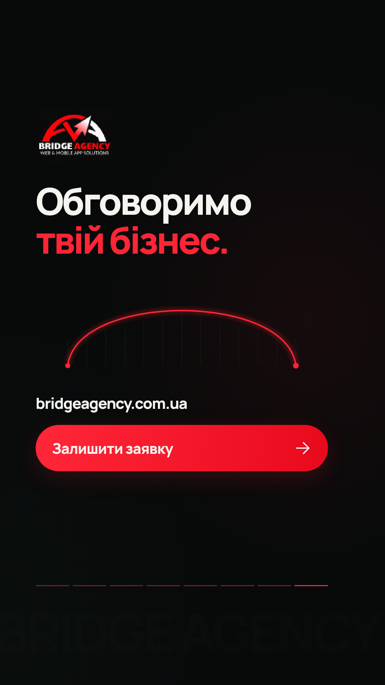

# Bridge Agency — рекламні ролики

Поточний ролик рекламує послугу «Лендінг за $150»: проблема з ціною в Instagram, зрозумілий сайт, реальний приклад і конкретна пропозиція Bridge. Попередні версії збережено для порівняння.

**Поточний етап:** рекламна версія «Лендінг за $150» із новим голосом, субтитрами та анімованою карткою пропозиції. 25 секунд, справжні 60 fps; основний MP4 1080p і майстер 4K. Також підготовлено контент-план на 14 днів.

- [MP4 для рекламного тесту — HQ / 60 fps](previews/bridge-reel-150-hq-60fps.mp4).
- [Майстер — 4K / 60 fps](previews/bridge-reel-150-master-4k-60fps.mp4).
- [Оригінальні MP4 одним ZIP-архівом](previews/bridge-reel-150-originals-60fps.zip).
- [Галерея нової рекламної версії](previews/landing-150-hq/index.html).

- [Перегляд MP4 — версія 2](previews/bridge-reel-v2.mp4) — 25 с, 1080 × 1920, 30 fps.
- [Перша версія для порівняння](previews/bridge-reel-v1.mp4).
- [Перегляд усіх екранів](previews/index.html) — після завантаження репозиторію відкрийте файл у браузері.
- [План сцен](docs/screen-plan.md).
- [Часові межі кожного слова](docs/timecodes.md).
- [Контент-план на 14 днів і тест реклами](docs/content-plan-14-days.md).
- [Чернетки семи наступних сценаріїв](docs/video-scripts-next.md).
- [Монтаж, таймкоди й експорт «Лендінг за $150»](docs/landing-150.md).
- [Архівний макет за $150 без диктора](previews/bridge-reel-150-layout.mp4) та [його галерея](previews/landing-150.html).



## Запуск

Потрібні Node.js 22 або новіший і npm. У хмарному середовищі встановлено Node.js 24 та Chromium. Залежності зафіксовані в `package-lock.json`.

```sh
npm ci
npm start
```

Команда `npm start` відкриває Remotion Studio для перегляду, перемотування та перевірки кадрів на вашому комп’ютері. Першою й за замовчуванням відкривається поточна композиція `BridgeLanding150` на 60 fps. Архівна композиція називається `BridgeReel`.

Для нової рекламної версії виберіть композицію `BridgeLanding150`:

```sh
npm run preview:stills -- --composition=BridgeLanding150 --final
npm run render -- --composition=BridgeLanding150 --final
npm run render -- --composition=BridgeLanding150 --final --master
```

```sh
npm run typecheck
npm run preview:stills
npm run render
```

Файли перегляду зберігаються в `previews/`. Рендер за замовчуванням створює `bridge-reel-150-hq-60fps.mp4`. Архівну V2 можна відтворити через `npm run render -- --composition=BridgeReel`; інший номер для неї задається через `--version=v3`. Для перевірки одного екрана поточного ролика:

```sh
npm run preview:stills -- --scene=150-05-offer
```

Для рендеру скрипт використовує `/usr/bin/chromium`, якщо він доступний. Інший встановлений браузер можна вказати через змінну `REMOTION_BROWSER_EXECUTABLE`. Якщо браузер не вказаний і системний Chromium відсутній, Remotion використовує свій стандартний механізм завантаження браузера.

У хмарному середовищі кеш npm треба розміщувати в доступній для запису папці:

```sh
NPM_CONFIG_CACHE=/workspace/.cache/npm npm ci
```

## Код екранів і матеріали

- `src/BridgeReel.tsx` — вісім сцен, анімація, графічні елементи й підсвічування субтитрів.
- `src/Root.tsx` — формат і тривалість композиції.
- `src/style.css` — локальний шрифт і базова типографіка.
- `data/scenes.json` — погоджений план та межі сцен.
- `data/words.json` — автоматично визначені часові межі слів.
- `data/captions.json` і `data/captions.srt` — групи субтитрів.
- `public/audio/voiceover.mp3` — затверджена озвучка ElevenLabs.
- `public/audio/atmosphere-v2.wav` — окрема тиха атмосфера та звуки інтерфейсу.
- `public/brand/` — матеріали, отримані з наданих PDF сайта.
- `public/fonts/` — Manrope й ліцензія SIL Open Font License.
- `scripts/render.mjs` — рендер окремих кадрів і MP4.
- `scripts/make-atmosphere.py` — відтворення звукового шару засобами стандартної бібліотеки Python; для звичайного рендеру Python не потрібен.

Інтерфейс бізнесу й форма заявки — демонстраційна графіка. Портфоліо композитної сітки та логотип взяті з PDF користувача. Точний оригінальний шрифт сайта не встановлено; у ролику використано Manrope із підтримкою української мови. Якість логотипа й портфоліо обмежена вихідними зображеннями в PDF.

У першій версії використано лише голос із підсиленням приблизно на 3,5 dB. У другій додано тиху синтезовану атмосферу й короткі звуки інтерфейсу; вони збережені окремим шаром. Оригінальна озвучка та часові межі не змінені. Таймкоди визначені автоматично та потребують оцінки синхронізації у перегляді, особливо на власних назвах. Правки до змісту, читабельності та темпу вносимо по одному зауваженню.

Другу версію оформлено стриманіше: прибрано дугу зі сцени сайта, смуги прогресу й фоновий напис; полегшено типографіку, картки, субтитри та світіння кнопок. Тонка дуга мосту залишена лише у фінальному екрані. Див. [історію правок](docs/revisions.md).
