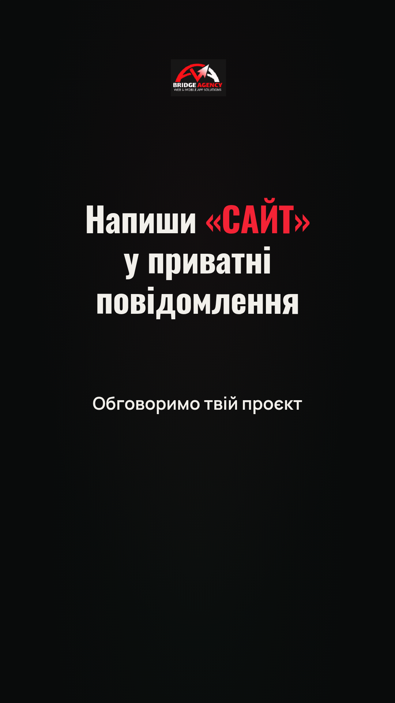

# Bridge Agency — рекламні ролики

Поточний ролик **«Лендінг для клінінгу — $150»** звертається до власника клінінгової компанії: клієнти постійно питають, що входить у ціну прибирання. Фото перетворюється на склад послуги, мобільну сторінку та форму заявки. Це один демонстраційний приклад без вигаданих цін на прибирання, відгуків або обіцянок гарантованих клієнтів.

**20 секунд, 9:16, 60 fps, 1200 кадрів.** Короткі синхронні українські субтитри; центр композиції x=540; безпечні поля 160 px зверху та з боків, 320 px знизу. Чорне тло, червоні акценти, Oswald і Manrope. Фінал рівно 3 секунди: **«Напиши “САЙТ” у приватні повідомлення»**, другорядний рядок «Обговоримо твій проєкт».

Повний оригінальний MP3 збережений. Для монтажу окремий WAV обрізано після основного заклику: фразу про безкоштовний аудит із наданого запису прибрано відповідно до письмового завдання. Темп і висоту голосу не змінено. Обидва MP4 готові: 1080×1920 та нативний 2160×3840, по 1200 кадрів при 60 fps. Повне декодування пройдено; звук обох файлів — −17,21 LUFS / −4,75 dBTP. Перевірено вісім основних кадрів і 13 кадрів переходів, SHA-256 оригінального MP3 та десяти попередніх MP4. Деталі — у [документі ролика](docs/cleaning.md).

- [Поточний MP4 — 1080 × 1920 / 60 fps](previews/bridge-reel-cleaning-hq-60fps.mp4).
- [Майстер — 2160 × 3840 / 60 fps](previews/bridge-reel-cleaning-master-4k-60fps.mp4).
- [Оригінали одним ZIP](previews/bridge-reel-cleaning-originals-60fps.zip).
- [Відео та вісім кадрів](previews/cleaning-hq/index.html).
- [Сценарій, монтаж і перевірки](docs/cleaning.md).

Попередній ролик «Фото є. А що обрати?»:

- [MP4 — 1080 × 1920 / 60 fps](previews/bridge-reel-photos-choice-hq-60fps.mp4).
- [Майстер — 2160 × 3840 / 60 fps](previews/bridge-reel-photos-choice-master-4k-60fps.mp4).
- [Оригінали одним ZIP](previews/bridge-reel-photos-choice-originals-60fps.zip).
- [Відео та кадри](previews/photos-choice-hq/index.html).
- [Сценарій, монтаж і перевірки](docs/photos-choice.md).

Попередній ролик «Сайт для малого бізнесу: $150 / $300»:

- [MP4 1080p / 60 fps](previews/bridge-reel-two-offers-hq-60fps.mp4).
- [Майстер 4K / 60 fps](previews/bridge-reel-two-offers-master-4k-60fps.mp4).
- [Оригінали одним ZIP](previews/bridge-reel-two-offers-originals-60fps.zip).
- [Сценарій і перевірки](docs/two-offers.md).

Попередній ролик «Знову ті самі питання?»:

- [MP4 1080p / 60 fps](previews/bridge-reel-direct-questions-hq-60fps.mp4).
- [Майстер 4K / 60 fps](previews/bridge-reel-direct-questions-master-4k-60fps.mp4).
- [Оригінали одним ZIP](previews/bridge-reel-direct-questions-originals-60fps.zip).
- [План і перевірки](docs/direct-questions.md).

Попередній ролик «Купив клік. А що далі?»:

- [MP4 1080p / 60 fps](previews/bridge-reel-ad-click-hq-60fps.mp4).
- [Майстер 4K / 60 fps](previews/bridge-reel-ad-click-master-4k-60fps.mp4).
- [Оригінали одним ZIP](previews/bridge-reel-ad-click-originals-60fps.zip).
- [План і перевірки](docs/ad-click.md).

Попередня схвалена рекламна версія «Лендінг за $150»:

- [MP4 для рекламного тесту — HQ / 60 fps](previews/bridge-reel-150-hq-60fps.mp4).
- [Майстер — 4K / 60 fps](previews/bridge-reel-150-master-4k-60fps.mp4).
- [Оригінальні MP4 одним ZIP-архівом](previews/bridge-reel-150-originals-60fps.zip).
- [Галерея нової рекламної версії](previews/landing-150-hq/index.html).

- [Перегляд MP4 — версія 2](previews/bridge-reel-v2.mp4) — 25 с, 1080 × 1920, 30 fps.
- [Перша версія для порівняння](previews/bridge-reel-v1.mp4).
- [Перегляд усіх екранів](previews/index.html) — після завантаження репозиторію відкрийте файл у браузері.
- [План сцен](docs/screen-plan.md).
- [Часові межі кожного слова](docs/timecodes.md).
- [Контент-план на 14 днів і тест реклами](docs/content-plan-14-days.md).
- [Чернетки семи наступних сценаріїв](docs/video-scripts-next.md).
- [Монтаж, таймкоди й експорт «Лендінг за $150»](docs/landing-150.md).
- [Архівний макет за $150 без диктора](previews/bridge-reel-150-layout.mp4) та [його галерея](previews/landing-150.html).



## Запуск

Потрібні Node.js 22 або новіший і npm. У хмарному середовищі встановлено Node.js 24 та Chromium. Залежності зафіксовані в `package-lock.json`.

```sh
npm ci
npm start
```

Команда `npm start` відкриває Remotion Studio для перегляду, перемотування та перевірки кадрів на вашому комп’ютері. Новий ролик має композицію `BridgeCleaning` на 60 fps. У переліку також залишено попередні `BridgePhotosChoice`, `BridgeTwoOffers`, `BridgeDirectQuestions`, `BridgeAdClick` та `BridgeLanding150` на 60 fps та архівну `BridgeReel` на 30 fps.

Новий ролик має окрему композицію `BridgeCleaning` та свої матеріали:

```sh
npm run typecheck
node scripts/render-cleaning.mjs --stills
node scripts/render-cleaning.mjs --master
node scripts/export-cleaning-from-master.mjs
python3 scripts/check-cleaning-export.py
python3 scripts/package-cleaning.py
```

Для попередньої схваленої рекламної версії виберіть композицію `BridgeLanding150`:

```sh
npm run preview:stills -- --composition=BridgeLanding150 --final
npm run render -- --composition=BridgeLanding150 --final
npm run render -- --composition=BridgeLanding150 --final --master
```

```sh
npm run typecheck
npm run preview:stills
npm run render
```

Файли перегляду зберігаються в `previews/`. Рендер за замовчуванням створює `bridge-reel-150-hq-60fps.mp4`. Архівну V2 можна відтворити через `npm run render -- --composition=BridgeReel`; інший номер для неї задається через `--version=v3`. Для перевірки одного екрана попереднього ролика:

```sh
npm run preview:stills -- --scene=150-05-offer
```

Для рендеру скрипт використовує `/usr/bin/chromium`, якщо він доступний. Інший встановлений браузер можна вказати через змінну `REMOTION_BROWSER_EXECUTABLE`. Якщо браузер не вказаний і системний Chromium відсутній, Remotion використовує свій стандартний механізм завантаження браузера.

У хмарному середовищі кеш npm треба розміщувати в доступній для запису папці:

```sh
NPM_CONFIG_CACHE=/workspace/.cache/npm npm ci
```

## Код екранів і матеріали

- `src/BridgeCleaning.tsx` — поточний ролик для клінінгу, мобільна сторінка, форма й одна фінальна дія.
- `data/cleaning.json` — 5 сцен і 9 коротких груп субтитрів; `data/words-cleaning.json` — 39 одиниць синхронізації.
- `public/audio/voiceover-cleaning.mp3` — повний оригінальний запис; `voiceover-cleaning-mix.wav` — окремий монтажний файл.
- `public/audio/voiceover-cleaning-edited.txt` — фактичний монтажний текст.
- `data/cleaning-layout-check.json` — вимірювання восьми кадрів; `data/cleaning-export-report.json` — результати перевірок обох готових MP4, звуку й контрольних сум.
- `src/BridgeReel.tsx` — вісім сцен, анімація, графічні елементи й підсвічування субтитрів.
- `src/Root.tsx` — формат і тривалість композиції.
- `src/style.css` — локальний шрифт і базова типографіка.
- `data/scenes.json` — погоджений план та межі сцен.
- `data/words.json` — автоматично визначені часові межі слів.
- `data/captions.json` і `data/captions.srt` — групи субтитрів.
- `public/audio/voiceover.mp3` — затверджена озвучка ElevenLabs.
- `public/audio/atmosphere-v2.wav` — окрема тиха атмосфера та звуки інтерфейсу.
- `public/brand/` — матеріали, отримані з наданих PDF сайта.
- `public/fonts/` — Manrope й ліцензія SIL Open Font License.
- `scripts/render.mjs` — рендер окремих кадрів і MP4.
- `scripts/make-atmosphere.py` — відтворення звукового шару засобами стандартної бібліотеки Python; для звичайного рендеру Python не потрібен.

Інтерфейси бізнесу — демонстраційна графіка. У поточному ролику використано лише фотографію прибирання з попередньої згенерованої ілюстрації; меблі у видиму область не потрапляють. У деяких попередніх 60 fps-роликах справжній сайт композитної сітки записано з оригінального вихідного коду; походження — `data/composite-capture-60-provenance.json`. Старі 30 fps-версії використовували зображення портфоліо з PDF. Логотип залишається матеріалом із PDF; його деталізація обмежена вихідним зображенням. Типографіка поточного ролика — Oswald і Manrope з підтримкою української мови.

У першій версії використано лише голос із підсиленням приблизно на 3,5 dB. У другій додано тиху синтезовану атмосферу й короткі звуки інтерфейсу; вони збережені окремим шаром. Оригінальна озвучка та часові межі не змінені. Таймкоди визначені автоматично та потребують оцінки синхронізації у перегляді, особливо на власних назвах. Правки до змісту, читабельності та темпу вносимо по одному зауваженню.

Другу версію оформлено стриманіше: прибрано дугу зі сцени сайта, смуги прогресу й фоновий напис; полегшено типографіку, картки, субтитри та світіння кнопок. Тонка дуга мосту залишена лише у фінальному екрані. Див. [історію правок](docs/revisions.md).
